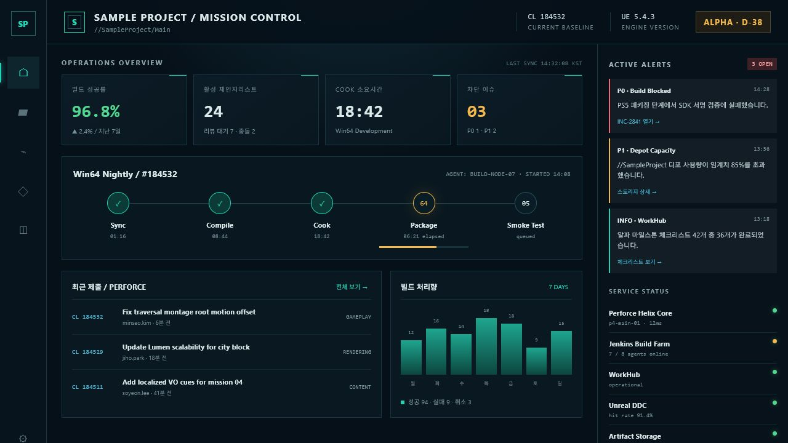
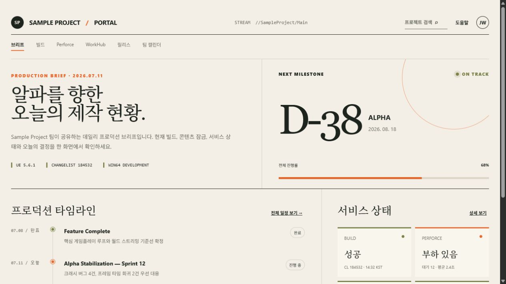
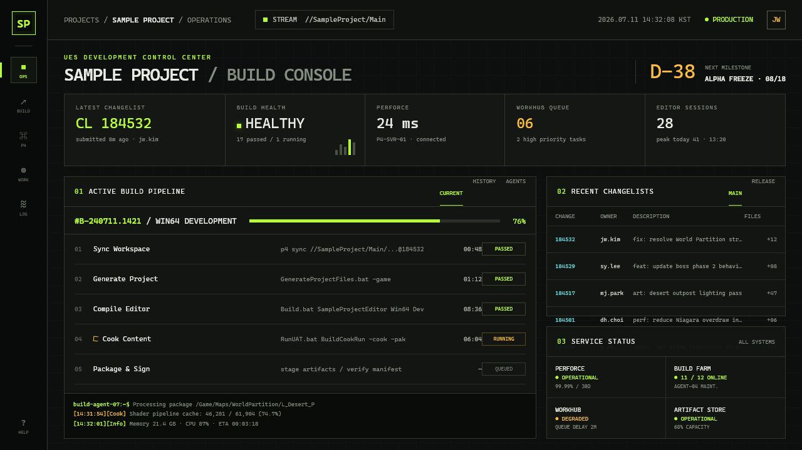
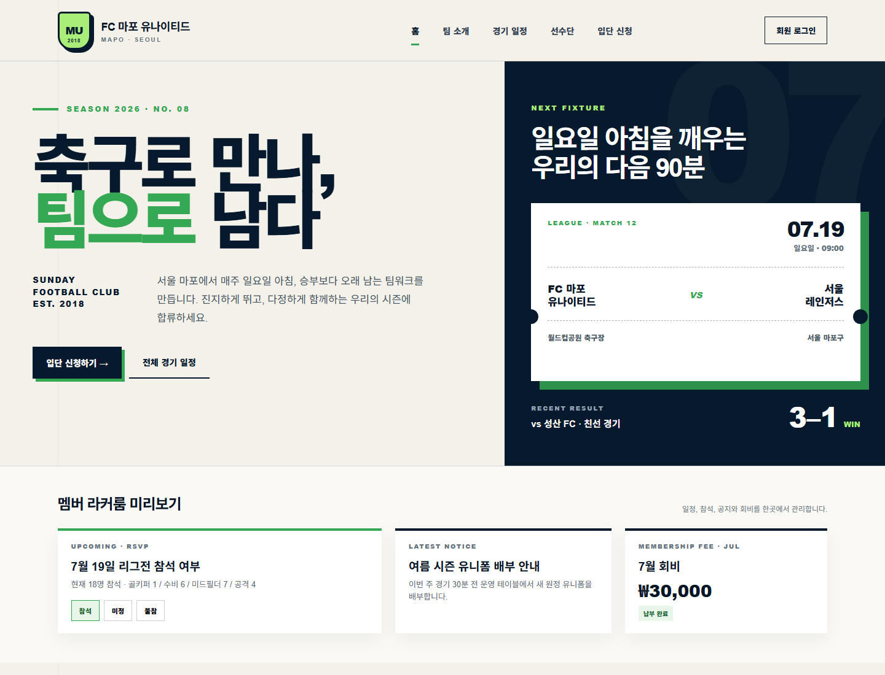
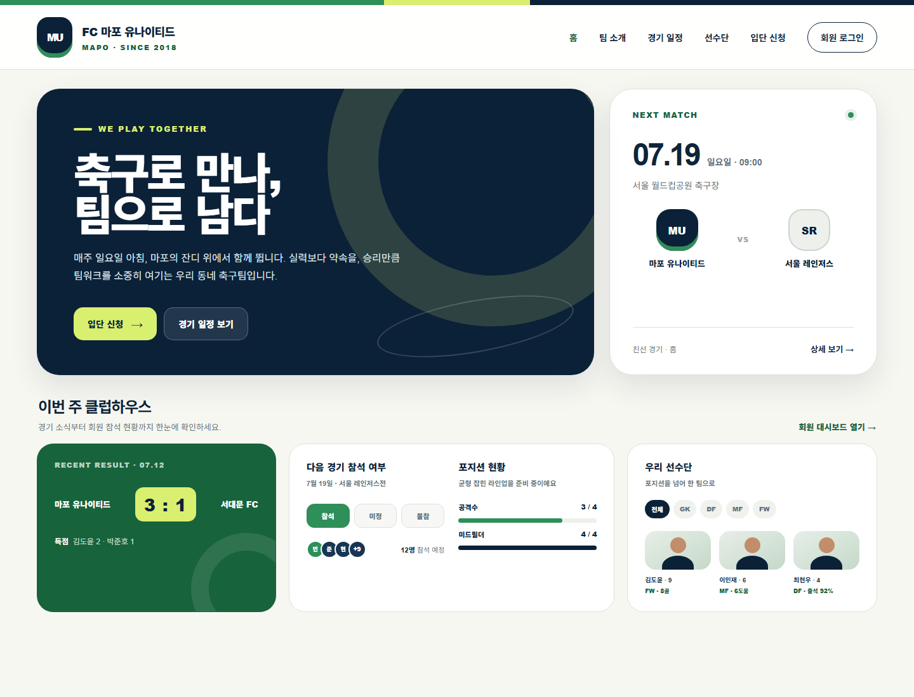
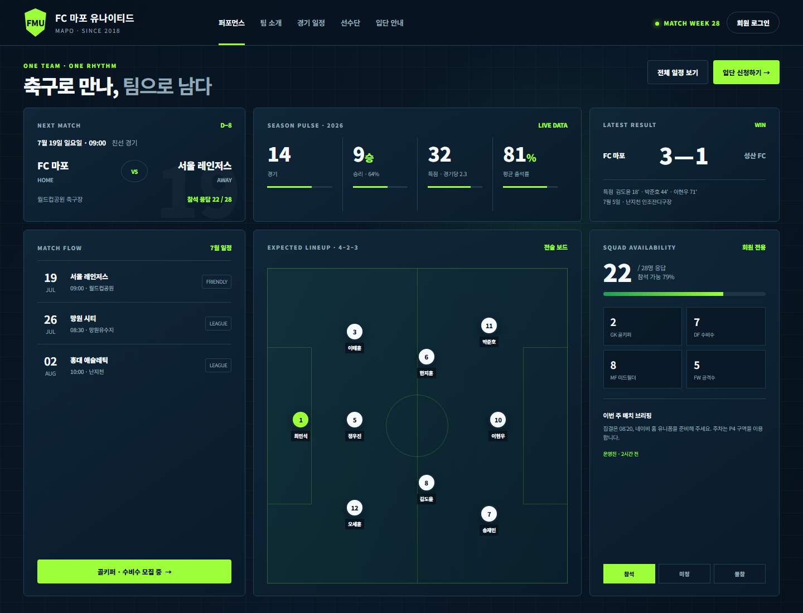

# designs

UI 디자인 시안 모음. 각 디자인은 **샘플 HTML + `design.md` 스펙 + PNG 미리보기** 한 세트로 자족적으로 구성됩니다.

## Sample Project — UE5 개발 관제 대시보드

동일한 콘텐츠(빌드 파이프라인 · 체인지리스트 · 서비스 상태)를 세 가지 컨셉으로 시각화한 시안입니다.

| 디자인 | 컨셉 | 테마 | 미리보기 |
|--------|------|------|----------|
| [mission-control](./mission-control/) | Mission Control — 우주 관제소 | 다크 네이비-틸 / 산세리프 |  |
| [production-brief](./production-brief/) | Production Brief — 에디토리얼 브리프 | 라이트 페이퍼 / Georgia 세리프 |  |
| [build-console](./build-console/) | Build Console — CI 터미널 콘솔 | 다크 / 라임·앰버 모노스페이스 |  |

각 폴더의 `design.md`에 컬러 토큰, 타이포그래피, 레이아웃, 컴포넌트, 반응형, 재현 체크리스트가 정리되어 있습니다.

## FC 마포 유나이티드 — 축구 클럽 랜딩

동호회 축구팀(FC 마포 유나이티드) 랜딩 페이지를 세 가지 컨셉으로 시각화한 시안입니다.

| 디자인 | 컨셉 | 테마 | 미리보기 |
|--------|------|------|----------|
| [editorial](./editorial/) | Editorial Sports — 스포츠 매거진 | 라이트 페이퍼 / Arial Narrow 초대형 헤드라인 |  |
| [clubhouse](./clubhouse/) | Clubhouse — 친근한 클럽하우스 | 라이트 / 라운드 카드 · 라임 포인트 |  |
| [performance](./performance/) | Performance Hub — 데이터 대시보드 | 다크 / 발광 라임 · 전술 보드 |  |

## 폴더 구조

```
designs/
├── mission-control/    # Sample Project — 샘플 HTML + design.md + PNG
├── production-brief/
├── build-console/
├── editorial/          # FC 마포 유나이티드
├── clubhouse/
└── performance/
```
